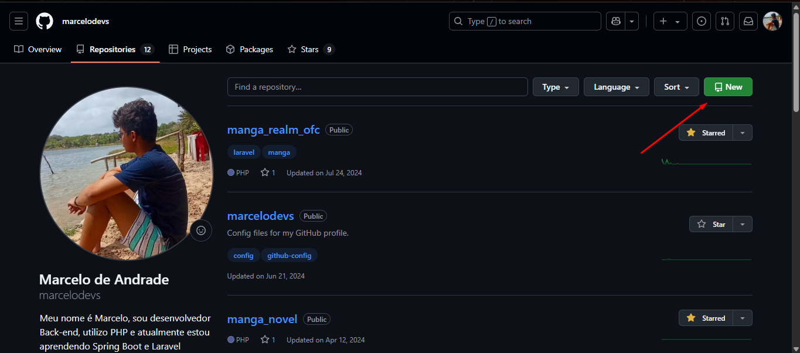
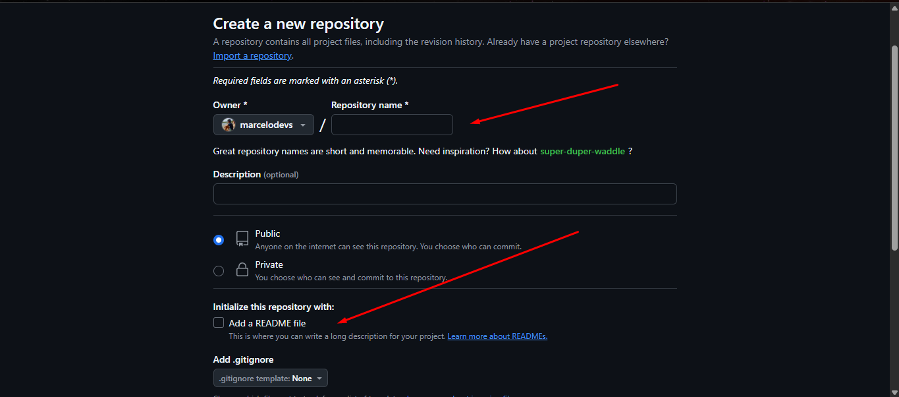
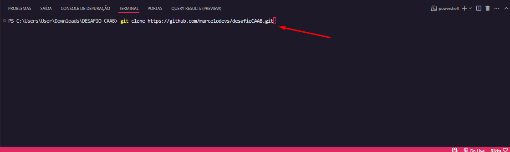
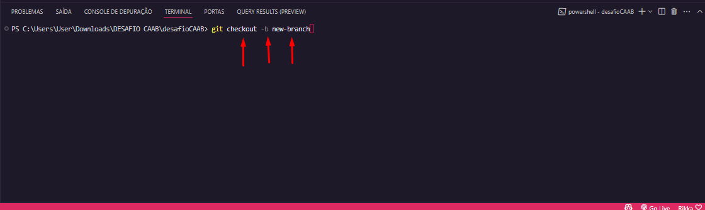
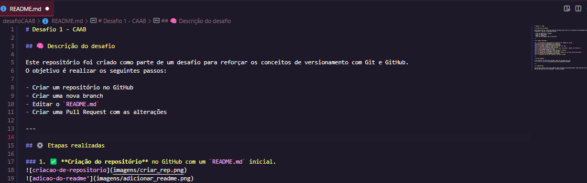
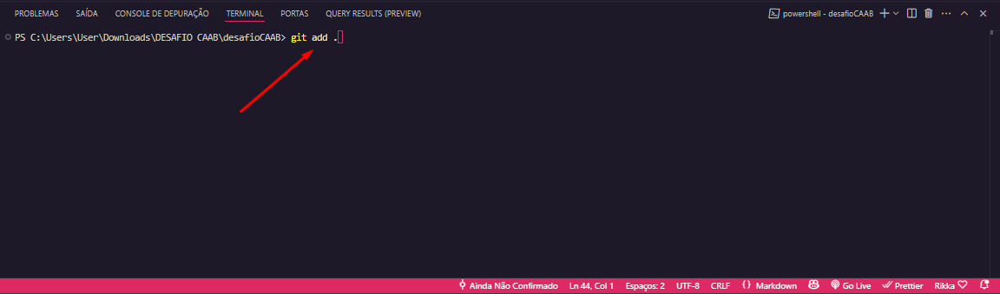
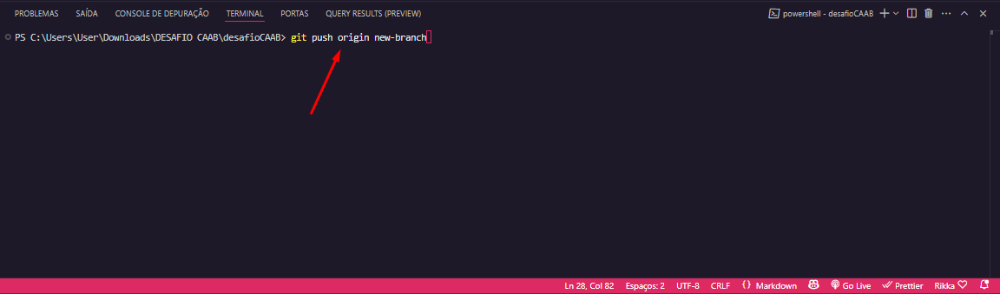
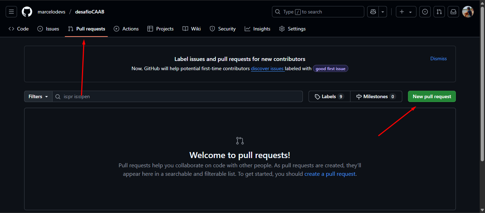

# Desafio 1 - CAAB

## 🧠 Descrição do desafio

Este repositório foi criado como parte de um desafio para reforçar os conceitos de versionamento com Git e GitHub.  
O objetivo é realizar os seguintes passos:

- Criar um repositório no GitHub
- Criar uma nova branch
- Editar o `README.md`
- Criar uma Pull Request com as alterações

---

## ⚙️ Etapas realizadas

### 1. ✅ **Criação do repositório** no GitHub com um `README.md` inicial.

### 2. ✅ **Clonagem local** do repositório usando `git clone`.

### 3. ✅ **Criação de uma nova branch** com o nome `nova-branch` usando `git checkout -b`.

> checkout serve para mudar de branch, enquanto o -b serve pra criar uma nova.
> ou seja: criar e mudar para uma nova branch

### 4. ✅ **Edição do `README.md`** para documentar o desafio.

### 5. ✅ **Commit das alterações** e envio para o GitHub com `git push origin new-branch`.

> o print a seguir mostra um "add .", que serve para adicionar todos os arquivos antes de dá um commit.

> o print a seguir mostra um "commit -m", que serve para dá um commit nos arquivos. O -m serve para colocar uma mensagem.
> "feat" é um padrão de commit muito utilizado em grandes projetos, ele facilita na hora de identificar o tipo de commit.

### 6. ✅ **Abertura de uma Pull Request** (PR) para revisão.

---
